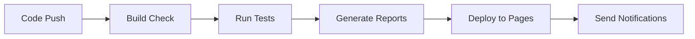

# Sales Portal Test Automation Framework

[](https://playwright.dev/)
[](https://www.typescriptlang.org/)
[](https://nodejs.org/)
[](https://allurereport.org/)

A comprehensive test automation framework for a Sales Portal application, implementing both API and UI testing using Playwright and TypeScript with advanced schema validation and notification systems.

## 📖 Table of Contents

- [Overview](#overview)
- [Features](#features)
- [Recent Updates](#recent-updates)
- [Tech Stack](#tech-stack)
- [Project Structure](#project-structure)
- [Setup](#setup)
- [Configuration](#configuration)
- [Running Tests](#running-tests)
- [Schema Validation](#schema-validation)
- [Reporting & Notifications](#reporting--notifications)
- [Code Quality](#code-quality)
- [CI/CD](#cicd)
- [Contributing](#contributing)
- [Advanced Development Patterns](#advanced-development-patterns)
- [License](#license)
- [Authors](#authors)
- [Troubleshooting](#troubleshooting)

## 🎯 Overview

This project is a production-ready test automation framework designed to test a Sales Portal application. It covers comprehensive testing scenarios for:

- **Products Management** - Create, read, update, delete product operations
- **Customers Management** - Customer lifecycle management  
- **Orders Management** - Order processing, delivery lifecycle, managers assignment, comments, notifications
- **Authentication & Authorization** - User login and role-based access
- **Data Validation** - Comprehensive JSON schema validation
- **Notifications** - Automated test result notifications via Telegram

The framework supports both API-level testing for backend validation and UI testing for end-to-end user workflows.

## ✨ Features

- **Dual Testing Approach**: API and UI test coverage
- **Advanced Schema Validation**: Comprehensive JSON schema validation with AJV
- **Modular Schema Architecture**: Reusable schema components for Orders, Delivery, Users
- **Page Object Model**: Structured UI automation with reusable components
- **Parallel Execution**: Multi-worker test execution for faster feedback
- **Multiple Playwright Projects**: Separate projects for setup, UI, API and headless Chromium
- **Test Artifacts**: Traces, screenshots, and video recording (configured in `playwright.config.ts`)
- **Test Tagging**: Organized test execution with smoke, regression tags
- **Allure Reporting**: Rich test reports with detailed analytics and environment info
- **Telegram Notifications**: Automated test result notifications
- **Code Quality Tools**: ESLint, Prettier, and Husky pre-commit hooks with lint-staged
- **GitHub Actions CI/CD**: Automated testing and report deployment
- **TypeScript**: Full type safety with comprehensive interfaces and IntelliSense support

## 🆕 Recent Updates

### Schema Validation Enhancements
- **New Schema Modules**: Added dedicated schemas for Orders, Delivery, and Users
- **Modular Design**: Schemas now import and reuse components for better maintainability
- **Type Safety**: Schema definitions now align with TypeScript interfaces
- **Validation Coverage**: Extended validation for complex nested objects

### Advanced Test Infrastructure
- **Smart Data Generation**: Enhanced customer and product data generation with validation rules
- **Notification System**: Telegram integration for automated test result notifications
- **Post-test Cleanup**: Automatic deletion of created entities (fixture-based teardown)
- **CI Notifications**: Telegram message is sent from GitHub Actions workflow
- **Enhanced Reporting**: Improved Allure reports with environment information

### Code Quality Improvements
- **Modern ESLint Configuration**: Updated to latest ESLint standards with TypeScript support
- **Lint-Staged Integration**: Pre-commit hooks now run targeted linting and formatting
- **GitHub Actions**: Comprehensive CI/CD pipeline with automated report deployment
- **Build Validation**: Separate workflow for TypeScript compilation checks

## 🛠 Tech Stack

| Category | Technology |
|----------|------------|
| **Test Framework** | Playwright 1.57.0 |
| **Language** | TypeScript 5.9.3 |
| **Schema Validation** | AJV 8.x with custom JSON schemas |
| **Reporting** | Playwright HTML, Allure Playwright 3.4.3 + allure-commandline 2.34.1 |
| **Code Quality** | ESLint 9.39.1, Prettier 3.7.3, Husky 9.1.7, lint-staged 16.2.7 |
| **CI/CD** | GitHub Actions (tests in Playwright Docker image) |
| **Utilities** | Lodash, Moment.js, Faker, BSON |

## 📁 Project Structure

```
src/
├── api/                          # API layer
│   ├── api/                      # Endpoint wrappers
│   │   ├── customers.api.ts
│   │   ├── login.api.ts
│   │   ├── notifications.api.ts
│   │   ├── orders.api.ts
│   │   └── products.api.ts
│   ├── apiClients/               # HTTP client abstraction
│   │   ├── baseApiClient.ts
│   │   ├── requestApi.ts
│   │   └── types.ts
│   ├── facades/
│   │   └── ordersFacade.service.ts
│   └── service/                  # Business flows/services
│       ├── customer.service.ts
│       ├── login.service.ts
│       ├── orders.service.ts
│       ├── products.service.ts
│       └── stores/
│           └── entities.store.ts
│
├── config/                       # Configuration
│   ├── apiConfig.ts
│   └── env.ts
│
├── data/                         # Test data + schemas + types
│   ├── salesPortal/
│   │   ├── constants.ts
│   │   ├── country.ts
│   │   ├── delivery-status.ts
│   │   ├── errors.ts
│   │   ├── notifications.ts
│   │   ├── order-status.ts
│   │   ├── customers/
│   │   ├── orders/
│   │   └── products/
│   ├── schemas/                  # JSON schemas (AJV)
│   │   ├── core.schema.ts
│   │   ├── customers/
│   │   ├── delivery/
│   │   ├── login/
│   │   ├── orders/
│   │   ├── products/
│   │   └── users/
│   ├── types/
│   │   ├── core.types.ts
│   │   ├── credentials.types.ts
│   │   ├── customer.types.ts
│   │   ├── delivery.types.ts
│   │   ├── metrics.types.ts
│   │   ├── notifications.types.ts
│   │   ├── order.types.ts
│   │   ├── product.types.ts
│   │   └── user.types.ts
│   └── tags.ts
│
├── fixtures/                     # Fixtures
│   ├── api.fixture.ts
│   ├── business.fixture.ts
│   ├── mock.fixture.ts
│   ├── pages.fixture.ts
│   └── index.ts
│
├── mock/
│   └── mock.ts
│
├── tests/
│   ├── api/
│   │   ├── customers/
│   │   ├── orders/
│   │   └── products/
│   └── ui/
│       ├── auth.setup.ts
│       ├── integration/
│       └── orders/
│
├── ui/
│   ├── pages/
│   │   ├── base.modal.ts
│   │   ├── base.page.ts
│   │   ├── confirmation.modal.ts
│   │   ├── export.modal.ts
│   │   ├── home.page.ts
│   │   ├── navbar.component.ts
│   │   ├── salesPortal.page.ts
│   │   ├── login/
│   │   ├── customers/
│   │   ├── orders/
│   │   └── products/
│   └── service/
│       ├── addNewCustomer.ui-service.ts
│       ├── addNewProduct.ui-service.ts
│       ├── assignManager.ui-service.ts
│       ├── comments.ui-service.ts
│       ├── customersList.ui-service.ts
│       ├── editProduct.ui-service.ts
│       ├── home.ui-service.ts
│       ├── login.ui-service.ts
│       ├── orderDetails.ui-service.ts
│       └── productsList.ui-service.ts
│
└── utils/
    ├── assertions/
    ├── date.utils.ts
    ├── enum.utils.ts
    ├── files/
    │   ├── csv.utils.ts
    │   └── exportFile.utils.ts
    ├── log.utils.ts
    ├── maskSecrets.ts
    ├── notifications/
    │   ├── notifications.service.ts
    │   └── telegram.service.ts
    ├── orders/
    ├── queryParams.utils.ts
    ├── report/
    │   └── logStep.utils.ts
    └── validation/
        ├── validateResponse.utils.ts
        └── validateSchema.utils.ts
```

## 🚀 Setup

### Prerequisites

- **Node.js** (v18 or higher recommended)
- **npm**
- **Git**
- **Java** (required to generate Allure reports locally)

### Installation

1. **Clone the repository:**

  ```bash
  git clone https://github.com/DorityTM/AQA_4_PROD_SALES_PORTAL.git
  cd AQA_4_PROD_SALES_PORTAL
  ```

2. **Install dependencies:**

  ```bash
  npm ci
  # or:
  npm install
  ```

3. **Install Playwright browsers:**

  ```bash
  npx playwright install
  ```

4. **Set up environment variables:**

  ```bash
  cp .env.dist .env
  ```

  Add required values to `.env`:

  ```env
  USER_NAME=your_username
  USER_PASSWORD=your_password
  SALES_PORTAL_URL=https://your-sales-portal.com
  SALES_PORTAL_API_URL=https://your-api.com

  # Required by some Orders/Managers scenarios (JSON array string)
  MANAGER_IDS=["id1","id2"]

  # Optional (used by CI workflow Telegram step and local TelegramService)
  TELEGRAM_BOT_TOKEN=your_bot_token
  TELEGRAM_CHAT_ID=your_chat_id
  ```

## ⚙️ Configuration

### Environment Variables

Environment variables are loaded by Playwright config from `.env` by default,
or from `.env.dev` when `TEST_ENV=dev` (see `playwright.config.ts`).

Required variables (see `src/config/env.ts`):

| Variable | Description | Required | Example |
|----------|-------------|----------|---------|
| `USER_NAME` | Login username | ✅ | admin@example.com |
| `USER_PASSWORD` | Login password | ✅ | secretPassword |
| `SALES_PORTAL_URL` | Frontend application URL | ✅ | https://sales-portal.com |
| `SALES_PORTAL_API_URL` | Backend API URL | ✅ | https://api.sales-portal.com |
| `MANAGER_IDS` | JSON array string of manager ids | ✅* | ["id1","id2"] |

Optional variables:

| Variable | Description | Required | Example |
|----------|-------------|----------|---------|
| `TELEGRAM_BOT_TOKEN` | Telegram bot token (CI notifications / optional local TelegramService) | ⚠️ | 123456:ABC-DEF |
| `TELEGRAM_CHAT_ID` | Telegram chat id (CI notifications / optional local TelegramService) | ⚠️ | -1001234567890 |

> ✅* Required by some Orders/Managers tests. `.env.dist` contains only base variables,
> so you may need to add `MANAGER_IDS` manually.

### Test Projects Configuration

Projects are defined in `playwright.config.ts`:

- `setup` (runs `src/tests/ui/auth.setup.ts` and generates `src/.auth/user.json`)
- `sales-portal-ui` (UI tests using storage state)
- `sales-portal-api` (API tests)
- `chromium` (UI tests in headless Chromium)

## 🧪 Running Tests

### Available Commands

Scripts are defined in `package.json`:

```bash
# All tests / build
npm test
npm run build

# UI
npm run test:ui
npm run test:ui:smoke
npm run test:ui:regression
npm run ui-mode
npm run ui-mode:dev

# API
npm run test:api
npm run test:api:regression

# Run with .env.dev
npm run test:dev

# Reports
npm run html-report-open
npm run allure-report
npm run allure-report-open
```

### Test Execution Examples

```bash
# Run specific projects
npx playwright test --project=sales-portal-api
npx playwright test --project=sales-portal-ui

# Run by tags
npx playwright test --grep "@smoke"
npx playwright test --grep "@regression"
```

### Post-test Cleanup (important)

- The repo currently relies on **fixture-based teardown** for cleanup (see `src/fixtures/api.fixture.ts`).
- Many tests also call `ordersApiService.fullDelete(token)` explicitly.
- Playwright `globalTeardown` is present in `playwright.config.ts` but is **commented out**.

### Test Tags System

Tags are defined in `src/data/tags.ts`.

| Tag | Description |
|-----|-------------|
| `@smoke` | Critical functionality tests |
| `@regression` | Regression suite |
| `@api` | API tests |
| `@ui` | UI tests |
| `@integration` | UI+API integration flows |
| `@e2e` | End-to-end tests |
| `@auth` | Auth tests |
| `@home` | Home page tests |
| `@products` | Products domain |
| `@customers` | Customers domain |
| `@orders` | Orders domain |
| `@managers` | Managers domain |

## 🔍 Schema Validation

### Comprehensive Validation Framework

The project implements a robust JSON schema validation system:

```typescript
// Example: Product validation
import { createProductSchema } from "data/schemas/products/create.schema";
import { validateResponse } from "utils/validation/validateResponse.utils";

validateResponse(response, {
  status: STATUS_CODES.CREATED,
  schema: createProductSchema,
  IsSuccess: true,
  ErrorMessage: null,
});
```

### Schema Architecture

- **Modular Design**: Reusable schema components
- **Type Alignment**: Schemas match TypeScript interfaces  
- **Validation Coverage**: Orders, Products, Customers, Users, Delivery
- **Error Reporting**: Detailed validation error messages

## 📊 Reporting & Notifications

### Allure Reporting

Advanced reporting with:
- **Environment Information**: Test environment details
- **Step-by-Step Execution**: Detailed test steps with attachments
- **Performance Metrics**: Test execution timing
- **Historical Trends**: Test stability analysis
- **Request/Response Logging**: Complete API interaction logs

### Telegram Notifications  

- CI sends a Telegram message from `.github/workflows/tests.yml` using GitHub secrets `TELEGRAM_BOT_TOKEN` and `TELEGRAM_CHAT_ID`.
- Locally, a `TelegramService` implementation exists in `src/utils/notifications/telegram.service.ts`.

## 🔧 Code Quality

### Modern Tooling Setup

```bash
# Code Quality Commands
npm run format                    # Check code style
npm run format:fix               # Fix code style issues  
npm run lint                     # Run ESLint
npm run lint:fix                 # Fix ESLint issues
npm run prettier                 # Check Prettier formatting
npm run prettier:fix             # Fix Prettier formatting
```

### Pre-commit Quality Gates

**Husky + Lint-Staged Configuration:**
- ✅ **TypeScript compilation** check
- ✅ **ESLint** validation with auto-fix
- ✅ **Prettier** formatting
- ✅ **Targeted linting** for changed files only

`lint-staged` configuration is defined in `lint-staged.config.js`:

```js
module.exports = {
  "*.ts": [() => "npm run build", "npm run lint:fix", "npm run prettier:fix"],
};
```

## 🚀 CI/CD

### GitHub Actions Workflows

**1. Test Execution Workflow (`.github/workflows/tests.yml`):**
```yaml
- API regression tests
- Allure report generation  
- GitHub Pages deployment
- Telegram notifications
- Java + Playwright environment setup
```

**2. Build Validation Workflow (`.github/workflows/build.yml`):**
```yaml
- TypeScript compilation check
- Pull request validation
- Node.js 22 environment
```

### Features

- **Automated Testing**: Triggers on push/PR to main
- **Report Deployment**: Auto-deploy to GitHub Pages  
- **Environment Secrets**: Secure credential management
- **Notification Integration**: Telegram alerts on completion
- **Manual Triggers**: `workflow_dispatch` support

### CI/CD Pipeline Flow



## 🎨 Advanced Development Patterns

### Data-Driven Testing (DDT)

```typescript
// Example: Customer creation test cases
export const CREATE_CUSTOMER_POSITIVE_CASES: ICreateCustomerCases[] = [
  {
    title: "Verifying email input: upper-case",
    customerData: generateCustomerData({ email: "TEST@EXAMPLE.COM" }),
  },
  // ... more test cases
];

for (const tc of CREATE_CUSTOMER_POSITIVE_CASES) {
  test(tc.title, async ({ customersApi }) => {
    const response = await customersApi.create(token, tc.customerData);
    // validation logic
  });
}
```

### Smart Data Generation

```typescript
// Enhanced data generation with validation rules
export function generateCustomerData(params?: Partial<ICustomer>): ICustomer {
  const data: ICustomer = {
    email: validEmail(),                    // Ensures valid email format
    name: onlyLetters(nameRaw, 40),        // Strips invalid characters
    phone: validPhone(),                   // Generates valid phone format
    // ... other validated fields
  };
  return { ...data, ...params };
}
```

### Service Layer Pattern

```typescript
// Business logic abstraction
export class CustomersApiService {
  async create(token: string, customerData?: ICustomer) {
    const data = generateCustomerData(customerData);
    const response = await this.customerApi.create(token, data);
    validateResponse(response, { 
      status: STATUS_CODES.CREATED,
      IsSuccess: true 
    });
    return response.body.Customer;
  }
}
```

## 🤝 Contributing

### Development Workflow

1. **Create feature branch:**
   ```bash
   git checkout -b feature/new-functionality
   ```

2. **Implement changes** following established patterns

3. **Quality checks** (automated via pre-commit):
   ```bash
   npm run format:fix
   npm run build
   npm test
   ```

4. **Commit with conventional format:**
   ```bash
   git commit -m "feat: add order management API tests"
   ```

5. **Create Pull Request** with detailed description

### Code Standards

- **TypeScript**: Strict mode with comprehensive type definitions
- **ESLint**: Modern configuration with TypeScript support  
- **Prettier**: Consistent formatting (120 char width, no single quotes)
- **Test Structure**: Clear describe blocks with proper tagging
- **Documentation**: JSDoc comments for complex functions
- **Error Handling**: Comprehensive error messages and validation

## 📝 License

This project is licensed under the ISC License.

## 👥 Authors

**Tatsiana Davidziuk** - [GitHub Profile](https://github.com/DorityTM)
**Aliaksei Harashchuk** - [GitHub Profile](https://github.com/aharashchuk)
**Diana Shurukhina** - [GitHub Profile](https://github.com/DiShurukhina)
**Palina Razumeika** - [GitHub Profile](https://github.com/rapolinka)
**Oleg Sushko** - [GitHub Profile](https://github.com/os8580)

---

## 🆘 Troubleshooting

### Common Issues

**Environment Setup:**
- Verify all environment variables in `.env`
- Check network connectivity to test environments  
- Ensure browser installation: `npx playwright install`
- Java installation for Allure: Required for report generation

**Test Execution:**
- Clear artifacts: `rm -rf test-results/ playwright-report/ allure-results/`
- Update dependencies: `npm update`
- Check TypeScript compilation: `npm run build`

**CI/CD Issues:**
- Verify GitHub secrets are configured
- Check workflow permissions for Pages deployment
- Ensure Telegram bot token is valid for notifications

**Schema Validation:**
- Validate schema syntax with AJV documentation
- Check type alignment between schemas and TypeScript interfaces
- Review validation error messages in test output

For additional support, please check the [Issues](https://github.com/DorityTM/AQA_4_PROD_SALES_PORTAL/issues) page.
